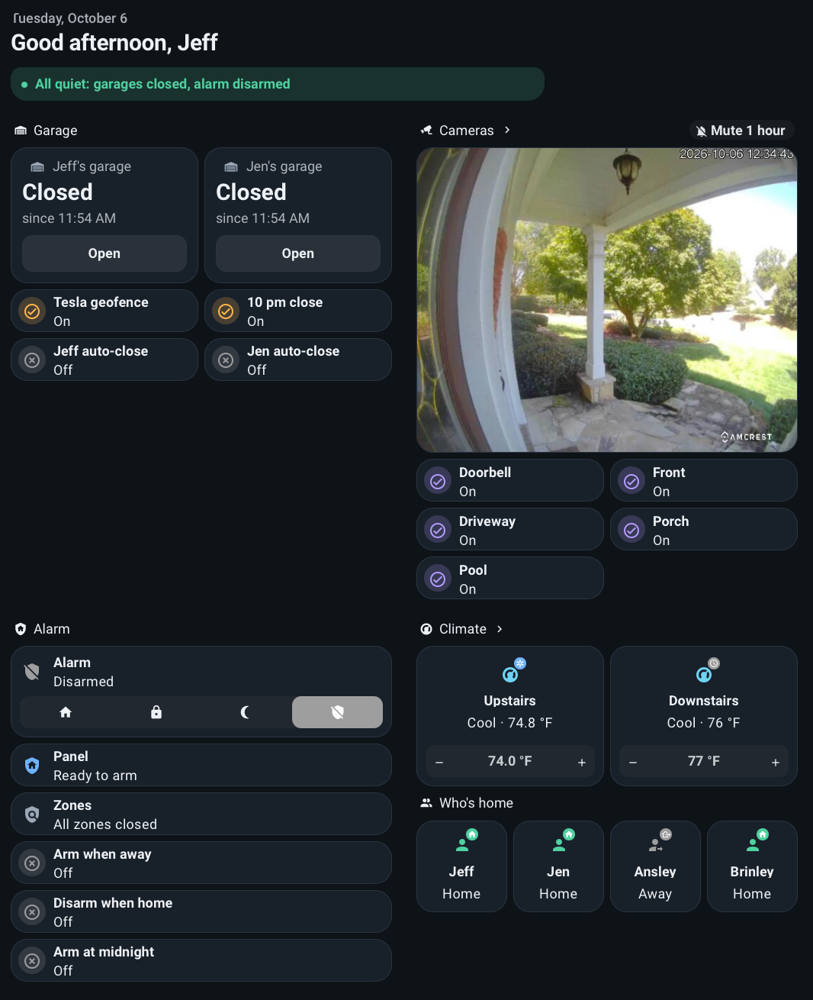
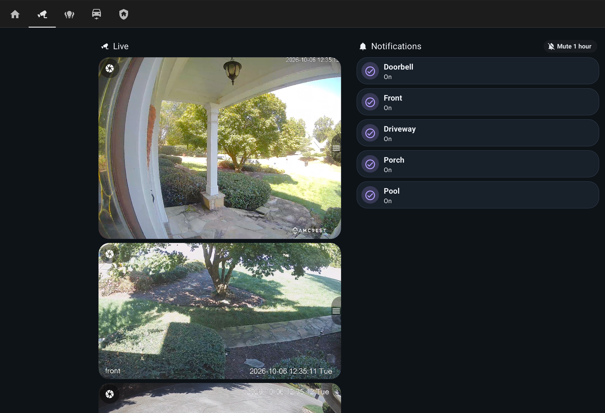
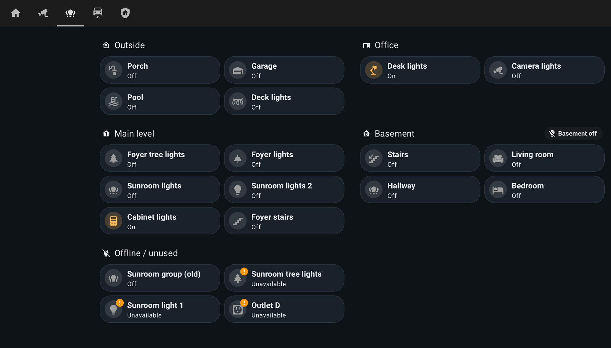
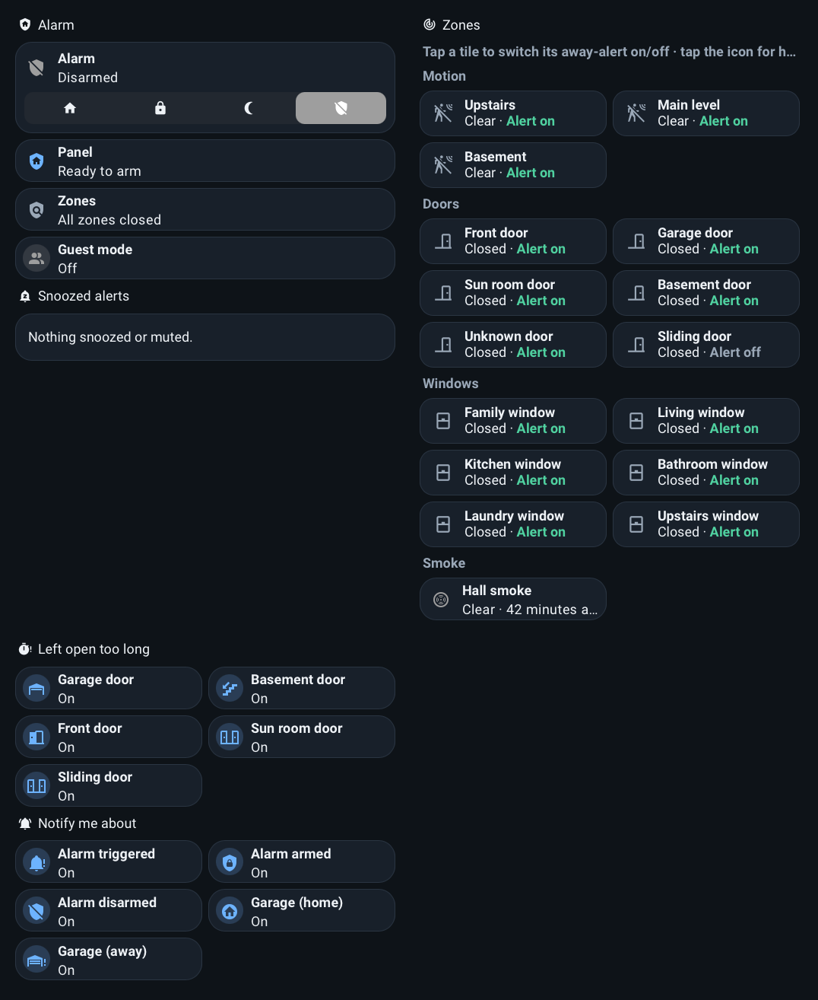
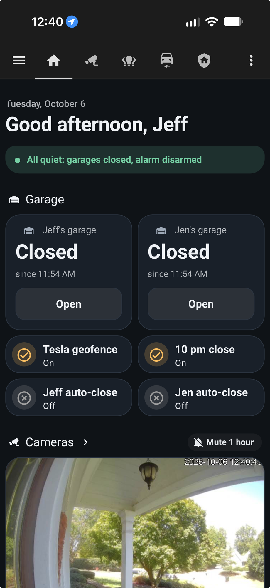
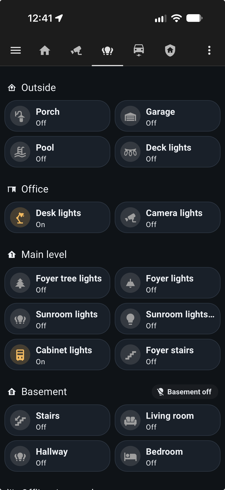
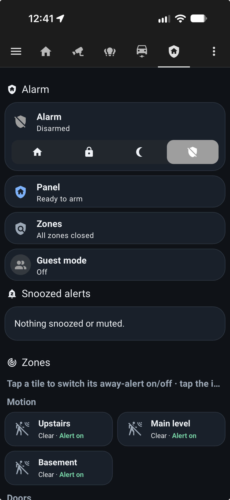

# Home Assistant Configuration

YAML configuration for a smart home, running [Home Assistant Core](https://home-assistant.io/) on [my Kubernetes cluster](https://github.com/billimek/k8s-gitops). The config is read and persisted by Home Assistant itself, and an embedded [code-server](https://github.com/coder/code-server) with the [Home Assistant config helper](https://marketplace.visualstudio.com/items?itemName=keesschollaart.vscode-home-assistant) is used to edit it live.

All automation logic is native Home Assistant YAML: no Node-RED, no external flow engine.

## Screenshots

Desktop

iOS app

## What it does

| Area | Capabilities |
|---|---|
| **Alarm** | AlarmDecoder panel (via ser2sock). Arms at midnight after turning the lights off, disarms at 05:00, disarms when someone arrives, arms when everyone leaves. Behavior is gated by toggles and an alarm mode (`automatic`, `standby`, `night only`). |
| **Sensor alerts** | 15 door, window and motion zones alert when triggered while nobody is home, with a per-sensor "Snooze 1 h". Six doors alert when left open for 5 minutes. |
| **Garage** | Two doors (OpenGarage). Open and close from the phone, a push when a door opens, a warning when you leave with one open, a weekday 2 h nag with optional auto-close, and a 10 pm auto-close. |
| **Tesla geofence** | Three cars via TeslaMate. The garage door closes when a car leaves and opens when it arrives, based on the Proximity distance to home. Car controls come from `tesla_custom`. |
| **Garage LEDs** | Garage-door state shown on the LED bars of Inovelli Z-Wave switches and dimmers. |
| **Lights** | Dusk and schedule lights (porch, sunroom, foyer, trees, cabinet, plants), motion and event lights (garage, deck, desk, stairs), and a midnight lights-off script. |
| **Presence** | Arrival pushes, Ecobee away and resume, guest mode. |
| **Cameras** | Frigate person, dog and cat detections on 5 cameras (doorbell, front, driveway, porch, pool), with per-camera rules, cooldowns and a "Mute 1 h" button. Reolink and Dahua cameras, Advanced Camera Card dashboards. |
| **Doorbell** | Dahua doorbell ring push with a live-view button, plus a watchdog that alerts if the Dahua event listener goes quiet for 6 hours. |
| **Water** | Basement and sump pump leak alerts, repeating until silenced or dry. |
| **Network** | Alert when a new device joins the WiFi (UniFi). |
| **Notifications** | One central iOS notification script with audiences, levels, avatars and action buttons. |
| **Guest mode** | One toggle, auto-off after 72 hours. No automatic arming, away sensor alerts silenced, porch and pool camera pushes muted. |

## Notifications

Every push goes through `script.notify_phones` ([scripts/notify.yaml](scripts/notify.yaml)), which takes an audience (Jeff, Jen or both), an iOS interruption level (passive, active, time-sensitive, critical), a tag, a group, a URL and action buttons. Each group gets its own avatar icon and color. `script.notify_clear` removes a push by tag. The exceptions are the Frigate camera pushes and the Discord messages.

Action buttons on the phone are handled by a single automation ([automation/notification_actions.yaml](automation/notification_actions.yaml)). Button ids follow the form `KIND|arg|arg` and cover disarm (with Face ID), garage open, close and snooze, sensor snooze, camera mute and water silence. Snoozes and mutes use `timer.*` helpers with `restore: true`, so they survive a restart.

Turning on `input_boolean.notify_test_mode` sends every push to Jeff's phone only.

The full catalog (trigger, recipients, level, buttons, clearing) is in [docs/notifications.md](docs/notifications.md).

## Repository layout

| Path | Contents |
|---|---|
| [configuration.yaml](configuration.yaml) | Core setup, helpers (`input_boolean`, `input_select`, `input_datetime`, `timer`), template sensors, notify group, Google Assistant |
| [automation/](automation/) | Hand-written automations, merged with `!include_dir_merge_list` |
| [automations.yaml](automations.yaml) | UI-created automations: the 5 Frigate camera pushes |
| [scripts/](scripts/) | Scripts, merged with `!include_dir_merge_named` |
| [config/](config/) | MQTT entities (garage MQTT sensors) and zones |
| [blueprints/automation/custom/](blueprints/automation/custom/) | Custom blueprints for the sensor alerts |
| [custom_components/](custom_components/) | Integrations installed outside HACS |
| [themes/](themes/) | Dashboard theme |
| [docs/](docs/) | Notification catalog and the generated automation map |
| [tools/](tools/) | `automation_map.pl`, which builds the automation map |
| `.storage/` | Dashboards (Overview, Original, Map) and their card resources |

### Automations

| File | Purpose |
|---|---|
| [alarm_logic.yaml](automation/alarm_logic.yaml) | Midnight lights-off and arm, 05:00 disarm, disarm on arrival, arm when everyone leaves |
| [alarm_notifications.yaml](automation/alarm_notifications.yaml) | Armed, disarmed, triggered and suspicious-disarm pushes, Discord message when triggered |
| [alarm.yaml](automation/alarm.yaml) | Sensor alerts (blueprints), iOS disarm action, AlarmDecoder watchdog |
| [guest_mode.yaml](automation/guest_mode.yaml) | Guest mode auto-off timer |
| [doorbell.yaml](automation/doorbell.yaml) | Ring push and Dahua listener watchdog |
| [garage.yaml](automation/garage.yaml) | iOS open and close garage actions |
| [garage_notifications.yaml](automation/garage_notifications.yaml) | Open, still-open, nag and night-close pushes |
| [garage_tesla.yaml](automation/garage_tesla.yaml) | Car geofence garage open and close |
| [garage_led.yaml](automation/garage_led.yaml) | Garage state on Inovelli LED bars |
| [lights.yaml](automation/lights.yaml), [lights_motion.yaml](automation/lights_motion.yaml) | Schedule, dusk and motion lights |
| [presence.yaml](automation/presence.yaml) | Arrival pushes, Ecobee away and resume |
| [water.yaml](automation/water.yaml) | Leak alerts |
| [network.yaml](automation/network.yaml) | New WiFi device alert |
| [notification_actions.yaml](automation/notification_actions.yaml) | Handler for every iOS action button |

### Scripts

| Script | Purpose |
|---|---|
| `script.notify_phones` | Central push: audience, level, tag, group, URL, buttons |
| `script.notify_clear` | Clear a push by tag |
| `script.lights_off` | Turn off the house lights at midnight |
| `script.mute_camera_notifications` | "Mute 1 hour" for every camera notification that is on |

### Custom blueprints

- **[sensor_alert_when_away.yaml](blueprints/automation/custom/sensor_alert_when_away.yaml)**: pushes when a door, window or motion sensor triggers while nobody is home. The push has a per-sensor "Snooze 1 h" button and clears when the sensor closes. Used by 15 automations.
- **[sensor_alert_timeout.yaml](blueprints/automation/custom/sensor_alert_timeout.yaml)**: pushes when a door or window stays open longer than a timeout (default 5 minutes). Used by 5 automations.

### Automation map

`perl tools/automation_map.pl` regenerates [docs/automation_map.html](docs/automation_map.html), a clickable flow map of triggers, automations, scripts and destinations, built from `automation/`, `scripts/` and the custom blueprints.

## Dashboards

The dashboards are UI-managed and stored in `.storage/`.

- **Overview**: Home, Cameras (Doorbell, Front, Driveway, Porch, Pool), Lights, Cars, Security, Climate, and a view for each family member
- **Original**: the earlier layout, still maintained
- **Map**

Cards come from HACS: [button-card](https://github.com/custom-cards/button-card), [Mushroom](https://github.com/piitaya/lovelace-mushroom), [Bubble Card](https://github.com/Clooos/Bubble-Card), [mini-graph-card](https://github.com/kalkih/mini-graph-card) and the [Advanced Camera Card](https://github.com/dermotduffy/advanced-camera-card). The theme is in [themes/home_new.yaml](themes/home_new.yaml).

## Presence and sensors

- `sensor.anyone_home` reads `home` when `group.family` is home or guest mode is on, and is `unavailable` while the group is unknown, so a restart can't trigger the away alerts.
- `zone.home` holds the number of people home; the presence, alarm and light automations trigger on it.
- Template sensors cover both garage doors (status and car present), the alarm (status, a readable panel message, and the zones currently open or tripped) and a weekday flag.
- Proximity distance sensors for each car drive the garage geofence.

## Integrations

| Category | Integrations |
|---|---|
| Security | AlarmDecoder (ser2sock), Frigate, Reolink, Dahua (custom), go2rtc |
| Garage and cars | OpenGarage, TeslaMate (MQTT discovery), `tesla_custom`, Proximity |
| Z-Wave and lights | Z-Wave JS (Inovelli switches and dimmers), Wyze devices over MQTT |
| Climate and water | Ecobee, Nest, Rachio, WeatherFlow |
| Appliances and power | GE Home (custom), Home Connect Alt (custom), NUT, Southern Company (custom) |
| Network | UniFi, UPnP, Brother and IPP printers, Apple TV, Cast |
| Voice and sharing | Google Assistant, HomeKit |
| Messaging and media | iOS companion app (`mobile_app`), Discord, Spotify |
| Observability | Prometheus |

### Tesla

TeslaMate publishes three cars (Elektra, KARR, Orion) to Home Assistant through MQTT discovery, so telemetry entities such as `sensor.elektra_battery` need no hand-written config. `tesla_custom` supplies the controls: buttons, locks, charge limit, seat heaters and climate. Its telemetry entities that duplicate TeslaMate's are disabled. The garage geofence reads `sensor.home_karr_distance` and `sensor.home_orion_distance` (200 ft threshold).

## Helpers and toggles

| Helper | Controls |
|---|---|
| `input_boolean.auto_arm_disarm_alarm_night` | Midnight arm and 05:00 disarm |
| `input_boolean.auto_alarm_presence` | Arm when everyone leaves, disarm when someone arrives |
| `input_boolean.auto_garage_doors` | Tesla geofence garage automation |
| `input_boolean.auto_garage_doors_night` | 10 pm garage auto-close |
| `input_boolean.auto_close_garage_door_jeff`, `_jen` | Auto-close after 2 h open |
| `input_boolean.notify_alarm_*`, `notify_garage_doors_*` | Per-notification on and off |
| `input_boolean.camera_<name>_notify` | Per-camera push on and off |
| `input_boolean.guest_mode` | Guest mode (72 h auto-off) |
| `input_boolean.notify_test_mode` | Send all pushes to Jeff only |
| `timer.*` | Restoring snoozes and mutes for garage, water, sensors and cameras |
| `input_datetime.dahua_last_event` | Last doorbell listener event, for the watchdog |

## Conventions

- YAML with 2-space indentation; `##` for section headers, `#` for inline comments.
- Entity ids are snake_case, in the pattern `{domain}.{location}_{device}_{attribute}`.
- Secrets come from environment variables with `!env_var`, never committed.
- Reload after editing: `automation.reload`, `script.reload`, `input_*.reload`. A new helper domain key in `configuration.yaml` needs a restart.
- Validate with `yamllint .` (config in [.yamllint](.yamllint)) or `ha core check`; the full check runs when Home Assistant restarts.
- Agent and contributor guidance is in [AGENTS.md](AGENTS.md).
